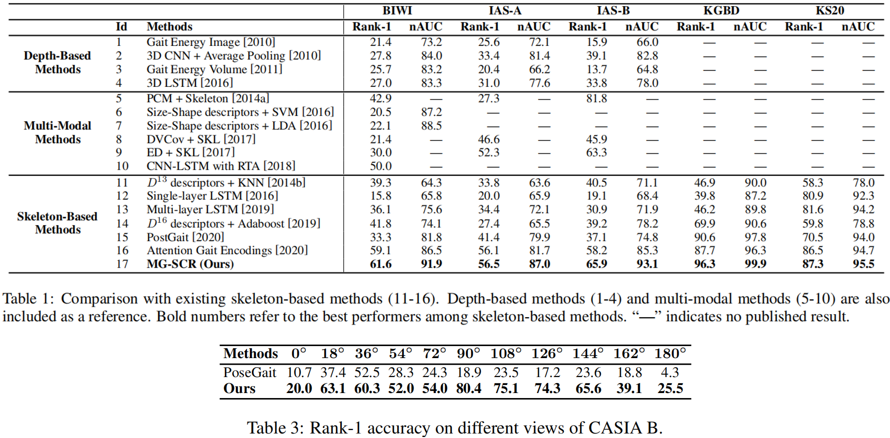

# Multi-Level Graph Encoding with Structural-Collaborative Relation Learning for Skeleton-Based Person Re-Identification
By Haocong Rao, Shihao Xu, Xiping Hu, Jun Cheng, Bin Hu. In [IJCAI 2021](https://www.ijcai.org/proceedings/2021/0135).

## Introduction
This is the official implementation of MG-SCR model presented by "Multi-Level Graph Encoding with Structural-Collaborative Relation Learning for Skeleton-Based Person Re-Identification". The codes are used to reproduce experimental results in the [**paper**](https://www.ijcai.org/proceedings/2021/0135.pdf).


Abstract: Skeleton-based person re-identification (Re-ID) is an emerging open topic providing great value for safety-critical applications. 
Existing methods typically extract hand-crafted features or model skeleton dynamics from the trajectory of body joints, while they rarely explore valuable relation information contained in body structure or motion. To fully explore body relations, we construct graphs to model human skeletons from different levels, and for the first time propose a Multi-level Graph encoding approach with Structural-Collaborative Relation learning (MG-SCR) to encode discriminative graph features for person Re-ID.
Specifically, considering that structurally-connected body components are highly correlated in a skeleton, we first propose a *multi-head structural relation layer* to learn different relations of neighbor body-component nodes in graphs, which helps aggregate key correlative features for effective node representations.
Second, inspired by the fact that body-component collaboration in walking usually carries recognizable patterns, we propose a *cross-level collaborative relation layer* to infer collaboration between different level components, so as to capture more discriminative skeleton graph features.
Finally, to enhance graph dynamics encoding, we propose a novel *self-supervised sparse sequential prediction* task for model pre-training, which facilitates encoding high-level graph semantics for person Re-ID. MG-SCR outperforms state-of-the-art skeleton-based methods, and it can achieve superior performance to many multi-modal methods that utilize extra RGB or depth information.

## Requirements
- Python 3.5
- Tensorflow 1.10.0 (GPU)

## Datasets and Models
We provide three already pre-processed datasets (BIWI, IAS, KGBD) with various sequence lengths on <br/>
https://pan.baidu.com/s/1fHMbYZ8H3hZYqrtENupBmA  &nbsp; &nbsp; &nbsp; password：&nbsp;  jtof  <br/>

All the best models reported in our paper can be acquired on <br/> 
https://pan.baidu.com/s/1EhPWg6pJ0Vl4xOh0swQSDQ &nbsp; &nbsp; &nbsp; password：&nbsp; e7oq  <br/> 
Please download the pre-processed datasets ``Datasets/`` and model files ``trained_models/`` into the current directory. <br/>

The original datasets can be downloaded here: [BIWI and IAS-Lab](http://robotics.dei.unipd.it/reid/index.php/downloads), [KGBD](https://www.researchgate.net/publication/275023745_Kinect_Gait_Biometry_Dataset_-_data_from_164_individuals_walking_in_front_of_a_X-Box_360_Kinect_Sensor), [KS20.](http://vislab.isr.ist.utl.pt/datasets/#ks20) <br/> 

Note: The access to the Vislab Multi-view KS20 dataset is available upon request. If you have signed the license agreement and been granted the right to use it, please contact me and I will share the pre-processed KS20 data.
 
 
## Usage

To (1) pre-train the MG-SCR model by sparse sequential prediction (SSP) and (2) fine-tune the model for person Re-ID on a specific dataset, simply run the following command: 

```bash
python train.py --dataset BIWI

# Default options: --dataset BIWI --split '' --length 6 --c_lambda 0.3 --task pre --gpu 0
# --dataset [BIWI, IAS, KGBD, KS20]
# --split ['A' (for IAS-A), 'B' (for IAS-B)] 
# --length [4, 6, 8, 10] 
# --task ['pre' (use SSP pre-training), 'none' (no pre-training)]
# --gpu [0, 1, ...]

```
Please see ```train.py``` for more details.

To print evaluation results (Re-ID Confusion Matrix / Rank-n Accuracy / Rank-1 Accuracy / nAUC) of the trained model, run:

```bash
python evaluate.py --dataset BIWI --model_dir trained_models/xx/xx

# Default options: --dataset BIWI --model_dir best --length 6 --gpu 0
# --dataset [BIWI, IAS, KGBD, KS20] 
# --model_dir [best (load the best models), trained_models/xx/xx (directory of model files, e.g., trained_models/best_models/KS20_87.3_95.5)] 
```
 
Please see ```evaluate.py``` for more details.

## Application to Model-Estimated Skeleton Data 
To extend our model to a large RGB-based gait dataset (CASIA B), we exploit pose estimation methods to extract 3D skeletons from RGB videos of CASIA B as follows:
- Step 1: Download [CASIA-B Dataset](http://www.cbsr.ia.ac.cn/english/Gait%20Databases.asp)
- Step 2: Extract the 2D human body joints by using [OpenPose](https://github.com/CMU-Perceptual-Computing-Lab/openpose)
- Step 3: Estimate the 3D human body joints by using [3DHumanPose](https://github.com/flyawaychase/3DHumanPose)

We provide already pre-processed skeleton data of CASIA B for Cross-View Evaluation (**CVE**) (f=20/30/40) on &nbsp; &nbsp; &nbsp; https://pan.baidu.com/s/1gDekBzf-3bBVdd0MGL0CvA &nbsp; &nbsp; &nbsp; password：&nbsp;  x3e5 <br/>
Please download the pre-processed datasets into the directory ``Datasets/``. <br/>

## Usage
To (1) pre-train the MG-SCR model by sparse sequential prediction (SSP) and (2) fine-tune the model for person Re-ID on CASIA B under **CVE** setup, simply run the following command:

```bash
python train-CASIA.py --view 0

# Default options: --dataset CASIA_B --split '' --length 20 --c_lambda 0.3 --task pre --gpu 0
# --length [20, 30, 40] 
# --view [0, 1, 2, 3, 4, 5, 6, 7, 8, 9, 10] 
# --task ['pre' (use SSP pre-training), 'none' (no pre-training)]
# --gpu [0, 1, ...]

```
Please see ```train-CASIA.py``` for more details. <br/>


## Results
| **Models**                       | **Rank-1** |       |       |      |      | **nAUC** |       |       |      |      |
|------------------------------|:------:|:-----:|:-----:|------|:----:|:----:|-------|-------|------|------|
|                              | **BIWI**   | **IAS-A** | **IAS-B** | **KS20** | **KGBD** | **BIWI** | **IAS-A** | **IAS-B** | **KS20** | **KGBD** |
| Gait Energy Image            | 21.4   | 25.6  | 15.9  |  —   |  —   | 73.2 | 72.1  | 66.0  |  —   |  —   |
| 3D CNN + Average Pooling     | 27.8   | 33.4  | 39.1  |  —   |  —   | 84.0 | 81.4  | 82.8  |  —   |  —   |
| Gait Energy Volume           | 25.7   | 20.4  | 13.7  |  —   |  —   | 83.2 | 66.2  | 64.8  |  —   |  —   |
| 3D LSTM                      | 27.0   | 31.0  | 33.8  |  —   |  —   | 83.3 | 77.6  | 78.0  |  —   |  —   |
| Size-Shape Descriptors + SVM | 20.5   |  —    |  —    |  —   |  —   | 87.2 |  —    |  —    |  —   |  —   |
| Size-Shape Descriptors + LDA | 22.1   |  —    |  —    |  —   |  —   | 88.5 |  —    |  —    |  —   |  —   |
| DVCov + SKL                  | 21.4   | 46.6  | 45.9  |  —   |  —   |  —   |  —    |  —    |  —   |  —   |
| ED + SKL                     | 30.0   | 52.3  | 63.3  |  —   |  —   |  —   |  —    |  —    |  —   |  —   |
| CNN-LSTM with RTA            | 50.0   |  —    |  —    |  —   |  —   |  —   |  —    |  —    |  —   |  —   |
| D-13 Descriptors + KNN       | 39.3   | 33.8  | 40.5  | 58.3 | 46.9 | 64.3 | 63.6  | 71.1  | 78.0 | 90.0 |
| Single-layer LSTM            | 15.8   | 20.0  | 19.1  | 80.9 | 39.8 | 65.8 | 65.9  | 68.4  | 92.3 | 87.2 |
| Multi-layer LSTM             | 36.1   | 34.4  | 30.9  | 81.6 | 46.2 | 75.6 | 72.1  | 71.9  | 94.2 | 89.8 |
| D-16 Descriptors + Adaboost  | 41.8   | 27.4  | 39.2  | 59.8 | 69.9 | 74.1 | 65.5  | 78.2  | 78.8 | 90.6 |
| PoseGait                     | 33.3   | 41.4  | 37.1  | 70.5 | 90.6 | 81.8 | 79.9  | 74.8  | 94.0 | 97.8 |
| Attention Gait Encodings     | 59.1   | 56.1  | 58.2  | 86.9 | 87.7 | 86.5 | 81.7  | 85.3  | 94.7 | 96.3 |
| **MG-SCR (Ours)**                | **61.6**   | **56.5**  | **65.9**  | **87.3** | **96.3** | **91.9** | **87.0**  | **93.1**  | **95.5** | **99.9** |
<!--  -->

## Model Size & Computational Complexity
| Methods  | # Params | GFLOPs |
|----------|----------|--------|
| PoseGait |   26.80M |  364.8 |
| [AGE](https://github.com/Kali-Hac/SGE-LA)      |    7.15M |   37.4 |
| [CAGE](https://github.com/Kali-Hac/Locality-Awareness-SGE)     |    8.47M |    7.5 |
| [MG-SCR (Ours)](https://github.com/Kali-Hac/MG-SCR)   |    1.04M |   19.8 |

## Citation
If you find this code useful for your research, please cite our paper
```bash
@article{rao2021multi,
  title={Multi-Level Graph Encoding with Structural-Collaborative Relation Learning for Skeleton-Based Person Re-Identification},
  author={Rao, Haocong and Xu, Shihao and Hu, Xiping and Cheng, Jun and Hu, Bin},
  journal={arXiv preprint arXiv:2106.03069},
  year={2021}
}
@inproceedings{ijcai2021-0135,
  title     = {Multi-Level Graph Encoding with Structural-Collaborative Relation Learning for Skeleton-Based Person Re-Identification},
  author    = {Rao, Haocong and Xu, Shihao and Hu, Xiping and Cheng, Jun and Hu, Bin},
  booktitle = {Proceedings of the Thirtieth International Joint Conference on
               Artificial Intelligence, {IJCAI-21}},
  publisher = {International Joint Conferences on Artificial Intelligence Organization},
  editor    = {Zhi-Hua Zhou},
  pages     = {973--980},
  year      = {2021},
  month     = {8},
  note      = {Main Track}
  doi       = {10.24963/ijcai.2021/135},
  url       = {https://doi.org/10.24963/ijcai.2021/135},
}
```

# Acknowledgements

Thanks to Veličković *et al.* for opening source of their excellent works [GAT](https://github.com/PetarV-/GAT). 
